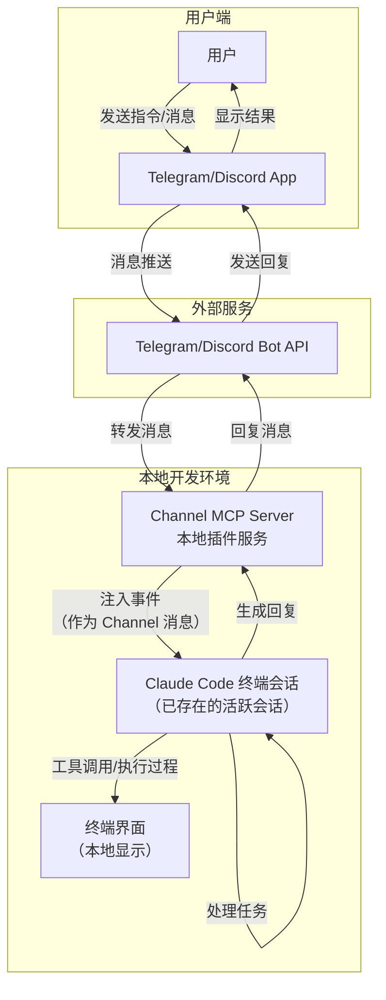

Claude Code Channels 是 Anthropic 为 Claude Code 新增的远程通信功能，允许你通过 Telegram 或 Discord 与本地运行的 Claude Code 会话进行交互。以下是基于最新技术文档对您三个问题的详细解答。
Claude Code Channels 技术架构图
为了帮助理解，下面是该模式的核心工作原理，展示了消息如何在聊天软件和终端会话之间流转：

1. 会话复用机制：并非复用，而是注入事件
不是复用同一个 session，而是向“已存在”的 session 注入外部事件。
当您在 CLI 终端启动一个 Claude Code 会话后，如果通过 --channels 标志启用了通道功能，这个正在运行的会话会启动一个 MCP 服务器开始监听外部消息。
此时，您的终端会话和聊天软件并不是在共享同一个输入流，而是聊天软件的消息被当作“外部事件”注入到了您现有的会话中。如果您的终端会话关闭，通道也会随之断开，无法再接收消息。
2. 通信实现机制：基于 MCP Server 的官方插件
是的，Channels 模式正是通过一个 MCP Server 来建立通信通道的。
Claude Code Channels 本质上是运行在本地的 MCP Server。根据官方设计：
· 架构：它作为一个插件（目前官方支持 Telegram 和 Discord），在您启动 Claude Code 时加载。
· 消息流转：聊天软件的消息 -> 发送到平台的 Bot API -> 转发到您本地的 MCP Server -> 转化为 Claude Code 会话中的 <channel> 事件。
· 依赖：该功能需要安装 Bun 运行时，并且目前仅支持 claude.ai 账户登录，不支持 API Key 认证。
3. 信息混淆与同步：双向显示但互不干扰
Claude Code 通过“单向反馈”机制来避免混淆，确保终端和聊天软件各司其职。
两者可以同时工作，但信息展示的逻辑不同，不会出现无法区分来源的情况：
· 终端视角（全量）：在您的电脑终端上，既会显示您通过聊天软件发送的指令，也会显示 Claude 调用工具（如读写文件、运行命令）的整个过程。终端是监控全貌的地方。
· 聊天软件视角（精简）：在 Telegram 或 Discord 上，只会显示 Claude 最终生成的回复文本。您不会在手机聊天软件上看到工具调用的具体细节或终端的实时输出（除非 Claude 特意将输出整理后发回）。
· 工作流建议：
  · 异步启动：您可以在终端启动一个长任务（如 claude --channels plugin:telegram "重构整个模块"），然后关闭电脑离开。
  · 远程交互：通过手机发送后续指令。
  · 权限处理：需要注意的是，如果任务需要您批准权限（如写入文件），聊天软件无法进行交互确认，您需要回到终端处理，或者启动时使用 --dangerously-skip-permissions 标志来跳过权限检查。
总结
Claude Code Channels 实现了终端会话与聊天客户端的解耦。它利用 MCP 协议将外部消息转化为会话内部的输入事件，同时通过区分“执行过程”（终端可见）和“结果反馈”（聊天可见），让你可以在保持终端会话运行的情况下，安全地通过手机远程指挥 AI 编程。
